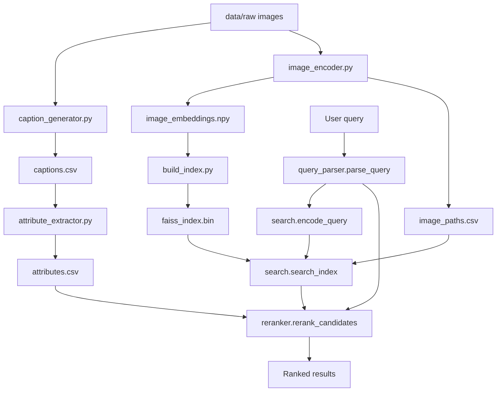

This is a four-stage offline indexing pipeline and text-to-image retrieval system for a fashion image dataset. Images are captioned with BLIP, parsed into structured attributes with a deterministic controlled-vocabulary parser, embedded with OpenCLIP, and indexed with FAISS. At query time, a natural-language query is parsed the same way, embedded with the OpenCLIP text encoder, matched against the FAISS index, and the resulting candidates are reranked by attribute overlap with the parsed query.

The project was evaluated on a fashion image dataset containing approximately 3,200 clothing images spanning shirts, jeans, dresses, jackets, footwear, and accessories.

---

## Features

- BLIP-based image captioning (`Salesforce/blip-image-captioning-base`) with beam search, resumable checkpointing every 100 images, and per-image error handling
- Deterministic, regex-based extraction of structured fashion attributes (garment type, color, accessories, scene, style) from captions — no LLM or external API calls
- OpenCLIP (`ViT-B-32`, `laion2b_s34b_b79k`) image and text embeddings, L2-normalized
- FAISS `IndexFlatIP` similarity search (cosine similarity via inner product on normalized vectors)
- Deterministic query parsing using the same controlled vocabularies as the attribute extractor
- Attribute-based reranking of FAISS candidates, with ties broken by FAISS similarity score
- Progress bars (`tqdm`) and structured logging throughout the indexing pipeline

---

## Pipeline Overview

**Indexing** (`indexer/`, run once):

```
data/raw/*.jpg
    ↓
caption_generator.py  (BLIP captioning)
    ↓
captions.csv
    ↓
attribute_extractor.py  (controlled-vocabulary parsing)
    ↓
attributes.csv

data/raw/*.jpg
    ↓
image_encoder.py  (OpenCLIP image encoder)
    ↓
image_embeddings.npy, image_paths.csv
    ↓
build_index.py  (FAISS IndexFlatIP)
    ↓
faiss_index.bin
```

**Retrieval** (`retriever/search.py`, run per query):

```
User query (typed at a prompt)
    ↓
query_parser.parse_query()  (controlled-vocabulary parsing)
    ↓
search.encode_query()  (OpenCLIP text encoder)
    ↓
search.search_index()  (FAISS similarity search)
    ↓
reranker.rerank_candidates()  (attribute-overlap scoring)
    ↓
Ranked results printed to console
```

---

## Repository Structure

```
.
├── data/
│   ├── raw/                       # input images
│   └── processed/                 # generated by the indexing pipeline
│       ├── captions.csv
│       ├── attributes.csv
│       ├── image_embeddings.npy
│       ├── image_paths.csv
│       └── faiss_index.bin
├── indexer/
│   ├── caption_generator.py       # Stage 1: BLIP captioning
│   ├── attribute_extractor.py     # Stage 2: caption → structured attributes
│   ├── image_encoder.py           # Stage 3: OpenCLIP image embeddings
│   └── build_index.py             # Stage 4: FAISS index construction
├── retriever/
│   ├── query_parser.py            # NL query → structured filters
│   ├── reranker.py                # attribute-based candidate reranking
│   └── search.py                  # orchestration: query → ranked results
├── notebooks/                     # reserved for experiments
├── report/                        # project report
├── results/                       # retrieval outputs
├── requirements.txt
└── README.md
```

---

## Installation

```bash
git clone https://github.com/dheeraj25406/fashion-retrieval-glance
cd fashion-retrieval-glance

python3 -m venv .venv
source .venv/bin/activate

pip install -r requirements.txt
```

`requirements.txt` lists: `torch`, `torchvision`, `transformers`, `open_clip_torch`, `faiss-cpu`, `Pillow`, `pandas`, `numpy`, `tqdm`, `sentence-transformers`, `accelerate`.

---

## Dataset

Images are expected under `data/raw/`, scanned recursively for `.jpg`, `.jpeg`, and `.png` files. The current repository contains 3,200 images directly under `data/raw/` (no subfolders).

The indexing pipeline generates the following under `data/processed/`:

| File | Produced by | Rows/shape |
|---|---|---|
| `captions.csv` | `caption_generator.py` | N rows |
| `attributes.csv` | `attribute_extractor.py` | N rows |
| `image_embeddings.npy` | `image_encoder.py` | `(N, 512)` float32 |
| `image_paths.csv` | `image_encoder.py` | N rows |
| `faiss_index.bin` | `build_index.py` | N vectors, dim 512 |

`image_paths.csv` row order matches `image_embeddings.npy` row order exactly, and both were used to build `faiss_index.bin` in that same order — `search.py` relies on this positional alignment to map FAISS result indices back to image paths.

---

## Indexing Pipeline

### `indexer/caption_generator.py`

**Purpose:** Generate a natural-language caption for every image using BLIP.

**Input:** All `.jpg`/`.jpeg`/`.png` files found recursively under `data/raw/`.

**Output:** `data/processed/captions.csv` with columns `image_path` (relative to `data/raw/`, POSIX-style) and `caption`.

**Behavior:** Loads `Salesforce/blip-image-captioning-base` via Hugging Face Transformers, selects Apple MPS if available and falls back to CPU otherwise, and generates each caption with beam search (`num_beams=5`, `max_new_tokens=30`, `early_stopping=True`) under `torch.inference_mode()`. Corrupted or unreadable images are logged and skipped rather than stopping the run. Results are appended to the output CSV every 100 processed images, and on a subsequent run, image paths already present in an existing `captions.csv` are read back in and skipped, so an interrupted run can be resumed without recaptioning already-processed images. Logs a summary of processed, skipped, and failed image counts, and total execution time, at the end of the run.

### `indexer/attribute_extractor.py`

**Purpose:** Deterministically parse each caption into structured fashion attributes.

**Input:** `data/processed/captions.csv`.

**Output:** `data/processed/attributes.csv` with columns `image_path`, `caption`, `upper_garment`, `lower_garment`, `outerwear`, `footwear`, `colors`, `accessories`, `scene`, `style`.

**Behavior:** Matches each caption's text against eight fixed controlled vocabularies using compiled, case-insensitive, whole-word regular expressions (vocabulary terms are sorted longest-first within each pattern so that overlapping terms, e.g. `t-shirt` vs `shirt`, do not shadow one another). `upper_garment`, `lower_garment`, `outerwear`, `footwear`, `scene`, and `style` store the first matching term found, or an empty string if none matched. `colors` and `accessories` store every distinct matching term found, comma-separated, in order of first appearance. No LLM or external API is used. A row that fails to parse is logged and skipped without stopping the run.

### `indexer/image_encoder.py`

**Purpose:** Generate a normalized OpenCLIP image embedding for every image.

**Input:** All `.jpg`/`.jpeg`/`.png` files found recursively under `data/raw/`.

**Output:** `data/processed/image_embeddings.npy` (float32 array, shape `[N, 512]`) and `data/processed/image_paths.csv` (single `image_path` column), with row `i` of each file corresponding to the same image.

**Behavior:** Loads OpenCLIP `ViT-B-32` with `laion2b_s34b_b79k` pretrained weights, selecting Apple MPS if available and falling back to CPU otherwise. Each image is preprocessed with OpenCLIP's inference-time transform, encoded under `torch.inference_mode()`, and L2-normalized (`embedding / embedding.norm(dim=-1, keepdim=True)`) before being stored. Corrupted or unreadable images, and any image that fails during encoding, are logged and skipped rather than stopping the run.

### `indexer/build_index.py`

**Purpose:** Build a FAISS index from the image embeddings.

**Input:** `data/processed/image_embeddings.npy`.

**Output:** `data/processed/faiss_index.bin`.

**Behavior:** Loads the embeddings array and validates that it is non-empty and of dtype `float32`, raising a `FileNotFoundError` if the input file is missing and a `ValueError` on an empty array or dtype mismatch. Embeddings are L2-normalized a second time with NumPy (`embeddings /= np.linalg.norm(embeddings, axis=1, keepdims=True)`) immediately before indexing, independent of whatever normalization was applied when they were generated. A `faiss.IndexFlatIP` is constructed with the embedding dimension, all vectors are added, and the index is saved with `faiss.write_index`. Logs and prints the embedding matrix shape, embedding dimension, and total number of indexed vectors.

---

## Retrieval Pipeline

`retriever/search.py` orchestrates retrieval by calling into `retriever/query_parser.py` and `retriever/reranker.py`. It does not rebuild the FAISS index, encode images, load `captions.csv`, or perform attribute extraction.

1. **`get_device()`** — returns `torch.device("cpu")` unconditionally. Unlike the indexer modules, this module does not check for MPS availability.
2. **`load_clip_model(device)`** — loads OpenCLIP `ViT-B-32` with `laion2b_s34b_b79k` pretrained weights and the matching tokenizer, the same model used during indexing.
3. **`load_faiss_index(path)`** — loads `data/processed/faiss_index.bin`, raising `FileNotFoundError` if it does not exist.
4. **`load_image_paths(path)`** — loads `data/processed/image_paths.csv` into an ordered list, preserving row order so that list position `i` corresponds to FAISS internal index `i`.
5. **`load_attributes(path)`** (from `reranker.py`) — loads `data/processed/attributes.csv` into an in-memory dictionary keyed by `image_path`.
6. **`build_vocab_patterns()`** (from `query_parser.py`) — compiles the controlled-vocabulary regex patterns.
7. The query is read interactively via `input("Enter your query: ")` inside `main()`; an empty query is logged as an error and the run exits without searching.
8. **`parse_query(query_text, patterns)`** — parses the raw query text into the same structured schema as `attributes.csv`, plus a `remaining_text` field containing whatever text did not match any vocabulary term. Every attribute field in the parsed query is a list, in contrast to `attributes.csv`, where `upper_garment`, `lower_garment`, `outerwear`, `footwear`, `scene`, and `style` are single strings and only `colors` and `accessories` are comma-separated multi-value strings.
9. **`encode_query(query_text, model, tokenizer, device)`** — encodes the *original* query text (not `remaining_text`) with the OpenCLIP text encoder under `torch.inference_mode()`, and L2-normalizes the resulting embedding.
10. **`search_index(query_embedding, index, image_paths, top_k)`** — searches the FAISS index for the top `top_k` (20) nearest neighbors by cosine similarity, and returns a list of `{"image_path": ..., "similarity": ...}` dictionaries in FAISS similarity order. If the index contains fewer than `top_k` vectors, a warning is logged and fewer candidates are returned.
11. **`rerank_candidates(candidate_results, parsed_query, attributes_by_path)`** (from `reranker.py`) — for each candidate, looks up its attribute row and computes an integer score via `compute_attribute_score`. For each of the six single-valued fields, a match contributes its fixed weight only if the candidate's value exactly equals one of the parsed query's terms for that field. For `colors` and `accessories`, a match contributes its fixed weight if the candidate's comma-separated terms and the query's terms have any overlap. Candidates with no attribute row are scored 0 rather than dropped. The final list is sorted by descending score, with ties broken by descending FAISS similarity; Python's stable sort preserves the original FAISS order for any remaining ties.
12. **`print_results(reranked_results)`** — prints each result's rank, image path (resolved under `data/raw/`), attribute score, and FAISS similarity score.

### Reranking weights

| Attribute | Points |
|---|---|
| Color match | +3 |
| Upper garment match | +3 |
| Lower garment match | +3 |
| Outerwear match | +3 |
| Footwear match | +3 |
| Style match | +2 |
| Scene match | +1 |
| Accessory match | +1 |

### How reranking differs from FAISS similarity alone

FAISS returns candidates ranked purely by cosine similarity between the query embedding and each image embedding — a single score derived from a single vector per item. `rerank_candidates` re-scores the same candidate set using the structured attribute fields extracted at indexing time, checking whether specific attributes the query asked for (e.g. a particular color, a particular garment type) are actually present in each candidate's parsed attributes, rather than relying on the embedding similarity alone to capture that correspondence.

---

## Running the Project

Run the indexing stages in order — each depends on the previous stage's output:

```bash
python3 -m indexer.caption_generator
python3 -m indexer.attribute_extractor
python3 -m indexer.image_encoder
python3 -m indexer.build_index
```

Then run retrieval:

```bash
python3 -m retriever.search
```

This will prompt for a query at the terminal (`Enter your query:`), then print the parsed query, number of FAISS candidates, and the final reranked results.

Each retriever module can also be run individually: `python3 -m retriever.query_parser` runs a fixed set of four example queries and prints the parsed output; `python3 -m retriever.reranker` runs a reranking demonstration against three hardcoded dummy candidates.

---

## Example Query

Running `python3 -m retriever.query_parser` parses the example query `"red formal jacket"` into:

```python
{
    "query": "red formal jacket",
    "remaining_text": "",
    "colors": ["red"],
    "upper_garment": [],
    "lower_garment": [],
    "outerwear": ["jacket"],
    "footwear": [],
    "accessories": [],
    "style": ["formal"],
    "scene": [],
}
```

---

## Technologies Used

Based on imports across the codebase: `torch`, `torchvision` (via `requirements.txt`), `transformers` (`BlipProcessor`, `BlipForConditionalGeneration`), `open_clip_torch` (`open_clip`), `faiss-cpu` (`faiss`), `Pillow` (`PIL.Image`), `numpy`, `tqdm`, and Python standard library modules (`csv`, `logging`, `re`, `time`, `pathlib`).

---

## Project Architecture



---

## Generated Artifacts

- **`captions.csv`** — columns `image_path`, `caption`. One BLIP-generated caption per image.
- **`attributes.csv`** — columns `image_path`, `caption`, `upper_garment`, `lower_garment`, `outerwear`, `footwear`, `colors`, `accessories`, `scene`, `style`. Structured attributes parsed deterministically from each caption.
- **`image_embeddings.npy`** — a `(N, 512)` float32 NumPy array of L2-normalized OpenCLIP image embeddings.
- **`image_paths.csv`** — single `image_path` column, row-aligned with `image_embeddings.npy`.
- **`faiss_index.bin`** — a serialized `faiss.IndexFlatIP` containing N vectors of dimension 512.

---

## Design Decisions

**Why OpenCLIP:** Used as the shared embedding model for both images (`image_encoder.py`) and text queries (`search.py`), so that image and query embeddings live in the same vector space and can be compared directly via cosine similarity.

**Why FAISS `IndexFlatIP`:** Inner product on L2-normalized vectors is mathematically equivalent to cosine similarity. `build_index.py` re-normalizes embeddings with NumPy immediately before indexing regardless of prior normalization, so the index's similarity scores are cosine similarities by construction.

**Why deterministic, rule-based attribute extraction instead of an LLM:** Both `attribute_extractor.py` and `query_parser.py` use fixed controlled vocabularies and compiled regular expressions rather than a language model. This makes attribute extraction reproducible and gives `query_parser.py` and `attribute_extractor.py` an identical vocabulary, so query-side and index-side attributes are always directly comparable by exact string or set-overlap matching.

**Why rerank after FAISS instead of relying on FAISS similarity alone:** FAISS produces a single similarity score per candidate, derived from a single embedding vector per image. `rerank_candidates` adds a second scoring pass over the same shortlist that checks specific structured attributes (color, garment type, scene, style) extracted at indexing time against what the parsed query explicitly asked for, and uses that as the primary sort key, falling back to FAISS similarity only to break ties.

---

## Sample Retrieval Results

| Query | Top Result | Observation |
|-------|------------|-------------|
| blue jeans | Blue jeans | Correct color and garment retrieved |
| pink shirt | Pink shirt | Exact garment and color matched |
| white sneakers | White sneakers | Correct footwear retrieved |
| black jacket | Black jacket | Correct outerwear retrieved |

The reranking stage consistently promotes candidates whose structured attributes
match the parsed query, improving semantic relevance over pure embedding similarity.


Here, the image with highest relevance is `data/raw/3b8410e6c6828c7ba45a7bc0e3e73112.jpg`
Opened it to verify the accuracy of retrieval.


Without reranking, FAISS returns images purely based on embedding similarity. In practice this may retrieve visually similar clothing that differs in color or garment type. The attribute-aware reranker promotes candidates matching explicit query constraints (e.g. color and garment category), leading to more precise top-ranked results.

Also, OpenCLIP embeddings are L2-normalized before indexing. Therefore FAISS inner-product scores are cosine similarities ranging approximately from -1 to 1. For real-world retrieval tasks, scores between 0.2 and 0.4 are common and are primarily useful for ranking rather than absolute confidence.

---

## Limitations

- **`style` is never populated in the current `attributes.csv`.** Across all the rows, `style` is an empty string in every row — none of the generated BLIP captions contain a word from the `style` controlled vocabulary (`formal`, `casual`, `sporty`, `traditional`, `party`, `business`). The style-match scoring weight (+2) is therefore inactive on the current dataset.
- **The majority of rows have no garment field populated.** most have empty `upper_garment`, `lower_garment`, and `outerwear` fields, most visibly because captions describing dresses, gowns, or other single-piece garments produce no match against any of the three garment vocabularies, none of which include a term for a dress.
- **Attribute matching does not bind attributes to specific garments.** `attributes.csv` stores `colors` as a flat, unordered list per image (e.g. `"red, white"`), with no record of which color belongs to which garment. `compute_attribute_score` can therefore score a candidate as matching a query like "red shirt, white pants" even if the image actually has a white shirt and red pants.
- **`get_device()` in `retriever/search.py` always returns CPU**, unlike the indexer modules' `get_device()`, which checks for MPS availability. Retrieval always runs on CPU regardless of hardware.
- **The query in `retriever/search.py` is read via an interactive `input()` prompt**, so `search.py` cannot currently be run non-interactively or with a query passed as an argument.

---

## Future Improvements

- Populate the `style` vocabulary with terms that actually occur in generated captions, or extend `attribute_extractor.py`'s vocabulary to cover garments (e.g. dresses) currently unmatched by any of the three garment categories.
- Bind colors and other attributes to the specific garment they describe, rather than storing them as a flat per-image list, to correctly handle compositional queries.
- Add MPS device selection to `retriever/search.py`, consistent with the indexer modules.
- Accept the query as a command-line argument in addition to the current interactive prompt.
