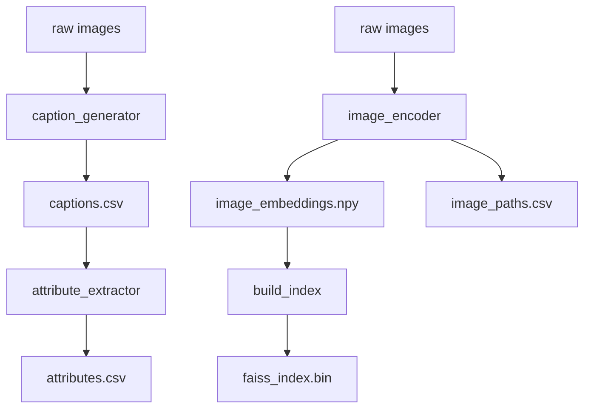

# indexer

The `indexer` module is the offline preprocessing pipeline for the fashion retrieval system. It transforms a raw folder of images into a set of searchable artifacts — captions, structured attributes, dense embeddings, and a similarity index — that the `retriever` module consumes at query time.

Indexing runs once (or whenever the dataset changes) and is deliberately decoupled from retrieval. Nothing in this module accepts a user query or performs a search; its only job is turning pixels into structured, searchable data ahead of time, so that query-time latency is dominated by a single embedding lookup rather than any per-image processing.

The pipeline has four stages, run in sequence:

1. **`caption_generator.py`** — generates a natural-language caption for every image.
2. **`attribute_extractor.py`** — parses those captions into structured fashion attributes.
3. **`image_encoder.py`** — embeds every image into a shared vector space.
4. **`build_index.py`** — builds a similarity index over those embeddings.

Stages 1–2 and stages 3–4 form two independent branches that both read from the same raw image folder but don't depend on each other's output — they converge only at retrieval time, when the retriever combines embedding similarity (from the index) with attribute matching (from the extracted metadata).

---

## Module Structure

| File | Responsibility |
|---|---|
| `caption_generator.py` | Produces one free-text caption per image using BLIP. This is the only stage that "looks at" the image semantically — everything downstream operates on its output. |
| `attribute_extractor.py` | Converts captions into structured, queryable fields (garment type, color, scene, style) using fixed vocabularies and regex matching. No model inference. |
| `image_encoder.py` | Produces a normalized OpenCLIP embedding per image, independent of captioning. This is what retrieval actually searches over. |
| `build_index.py` | Wraps the embeddings in a FAISS index for fast nearest-neighbor lookup at query time. |

---

## Indexing Pipeline



The captioning/attribute branch and the embedding/indexing branch both start from the same raw images but run independently — captioning doesn't need embeddings, and embedding doesn't need captions. This means the two branches can, in principle, run in either order or in parallel; the only hard sequencing constraint is *within* each branch (attributes need captions, the index needs embeddings).

At retrieval time, both branches are used together: the FAISS index handles approximate semantic similarity, while `attributes.csv` gives the retriever a structured way to verify specific query terms (a color, a garment type) that a single embedding similarity score can't reliably capture on its own.

---

## Core Components

### `caption_generator.py`

Produces a natural-language description of each image using BLIP (`Salesforce/blip-image-captioning-base`) with beam search decoding, which gives noticeably more descriptive captions than greedy decoding — worth the extra inference cost for a stage that only runs once per image.

The one architecturally significant detail: captioning a large dataset is slow and can be interrupted. The generator checkpoints to disk every 100 images and skips any path already present in the output CSV on restart, making the stage resumable rather than all-or-nothing.

**Output:** `captions.csv`. **Consumed by:** `attribute_extractor.py` only.

### `attribute_extractor.py`

Converts unstructured captions into structured fields — color, garment category, scene, style — using deterministic regex matching against fixed controlled vocabularies, not an LLM or classifier.

This is what makes attribute-based reranking possible downstream: the retriever's query parser uses the *same* vocabularies, so a caption's extracted `color: "red"` and a query's parsed `color: "red"` are compared as identical strings, with no embedding similarity or fuzzy matching involved. The trade-off is a closed vocabulary that never generalizes past what it's given, in exchange for matching that's exact, fast, and fully reproducible.

**Output:** `attributes.csv`. **Consumed by:** the retriever's reranking stage, as its source of per-image ground truth.

### `image_encoder.py`

Produces a fixed-size OpenCLIP embedding (`ViT-B-32`, `laion2b_s34b_b79k`) for each image — the same checkpoint the retriever uses to embed incoming text queries. Using one shared model on both sides is what makes cosine similarity between an image and a query embedding meaningful; mismatched encoders would produce vectors that simply aren't comparable.

Every embedding is L2-normalized before being stored, so a plain inner product later becomes equivalent to cosine similarity — this is what lets the index use the cheapest possible comparison at query time.

**Output:** `image_embeddings.npy` and `image_paths.csv`, generated together and only meaningful as a pair (see [Data Flow](#data-flow)). **Consumed by:** `build_index.py`.

### `build_index.py`

Wraps the embedding matrix in a FAISS `IndexFlatIP` — an exact, non-approximate inner-product index — so the retriever doesn't need to compute similarity against every stored embedding on every query. Embeddings are L2-normalized a second time immediately before indexing, independent of whatever normalization happened during encoding, so correctness here doesn't silently depend on the previous stage having normalized correctly.

**Output:** `faiss_index.bin`. **Consumed by:** the retriever, as its nearest-neighbor search backend.

---

## Generated Artifacts

| Artifact | Producer | Contents | Used during retrieval for |
|---|---|---|---|
| `captions.csv` | `caption_generator.py` | One free-text caption per image. | Not read directly by the retriever — it's an intermediate artifact consumed only by `attribute_extractor.py`. |
| `attributes.csv` | `attribute_extractor.py` | One row per image with structured fields: garment types, colors, scene, style. | Reranking FAISS candidates against a parsed query's structured attributes. |
| `image_embeddings.npy` | `image_encoder.py` | A float32 matrix of L2-normalized OpenCLIP image embeddings. | Building the FAISS index (not read directly by the retriever at query time). |
| `image_paths.csv` | `image_encoder.py` | The image path corresponding to each row of `image_embeddings.npy`, in the same order. | Mapping a FAISS result position back to an actual image file. |
| `faiss_index.bin` | `build_index.py` | A serialized FAISS `IndexFlatIP` over all image embeddings. | The actual nearest-neighbor search at query time. |

---

## Data Flow

The critical dependency here is **positional alignment**, not just file order. `image_embeddings.npy`, `image_paths.csv`, and `faiss_index.bin` all encode the same underlying ordering of images, but none stores an explicit identifier linking a vector back to a file — row `i` of the embeddings matrix corresponds to row `i` of `image_paths.csv`, and that same row is FAISS internal index `i`. This shared row order is the *only* thing tying a search result back to an actual image.

That's fast and simple, but it means correctness depends entirely on these three artifacts having been generated together and never independently modified afterward. If the index were rebuilt from a reordered image set without regenerating `image_paths.csv` to match, searches would still return results — just silently pointing to the wrong images, with nothing in the pipeline that would detect or flag it. Staying synchronized is an operational discipline the retriever assumes, not something enforced by the code.

`attributes.csv` is looser-coupled — keyed by image path rather than row position, so it tolerates being regenerated independently of the embedding/index branch.

---

## Design Decisions

**BLIP for captioning.** A well-established, open-weight captioning model that runs comfortably offline without depending on an external API — appropriate for a stage that only needs to run once per image.

**Regex-based attribute extraction instead of an LLM.** An LLM could plausibly extract richer attributes from a caption, but would be non-deterministic run-to-run and harder to keep in exact lockstep with the query parser's vocabulary. Regex matching against a shared, fixed vocabulary guarantees a query term and an indexed attribute are always compared as identical strings — a ceiling on flexibility traded for full reproducibility and speed.

**OpenCLIP for embeddings.** CLIP-family models are trained specifically to place images and text in a shared embedding space, which is exactly the property retrieval needs. OpenCLIP provides open, reproducible pretrained weights rather than depending on a closed API for every embedding call.

**FAISS `IndexFlatIP`.** A flat index performs exact, brute-force nearest-neighbor search — no approximation, no index-specific tuning. At the dataset sizes this pipeline currently targets, exact search is fast enough that the added complexity of an approximate index isn't yet justified (see [Limitations](#limitations)).

**Indexing runs offline, not at query time.** Captioning, attribute extraction, and embedding are all comparatively expensive per-image operations. Doing them once, ahead of time, means query latency is dominated by a single query embedding call and one index lookup — not by any per-image processing repeated on every search.

---

## Running the Pipeline

The four stages must be run in order — each depends on the output of the previous one within its branch:

```bash
python -m indexer.caption_generator
python -m indexer.attribute_extractor
python -m indexer.image_encoder
python -m indexer.build_index
```

`attribute_extractor.py` will fail immediately if `captions.csv` doesn't exist yet, and `build_index.py` will fail immediately if `image_embeddings.npy` doesn't exist yet — there's no silent fallback or auto-generation of missing upstream artifacts. Each stage is a standalone script and can be re-run independently once its inputs are present; `caption_generator.py` is additionally safe to re-run after an interruption, since it resumes rather than restarting from scratch.

---

## Limitations

- **Caption quality is a ceiling on attribute quality.** Since attribute extraction only sees what BLIP wrote, any garment, color, or context the caption fails to mention is simply unrecoverable downstream — there's no fallback path that looks at the image again.
- **The attribute vocabulary is closed.** Captions containing garments or terms outside the predefined vocabulary lists (for example, dress-like garments, which aren't currently covered by any of the garment categories) produce no match for that field, even if the caption clearly describes something relevant.
- **The `style` field depends entirely on caption phrasing.** If captions never happen to use one of the predefined style words (formal, casual, sporty, etc.), that field stays empty across the whole dataset — this is a property of what the captioning model tends to describe, not a bug in the extraction logic.
- **Attributes are recorded at the image level, not the garment level.** A caption mentioning two garments and two colors produces two color values and two garment values on the same row, with no indication of which color belongs to which garment. This limits how precisely compositional queries (e.g. "red jacket, black pants") can be verified downstream.
- **The FAISS index must be rebuilt whenever embeddings change.** There's no incremental update path — adding, removing, or re-encoding images means regenerating `image_embeddings.npy` and rerunning `build_index.py` from scratch.
- **`IndexFlatIP` performs exact search and scales linearly with dataset size.** This is a reasonable choice at the current scale, but an approximate index (e.g. IVF or HNSW-based) would become preferable if the dataset grew large enough that linear-scan search latency became a bottleneck at query time.
