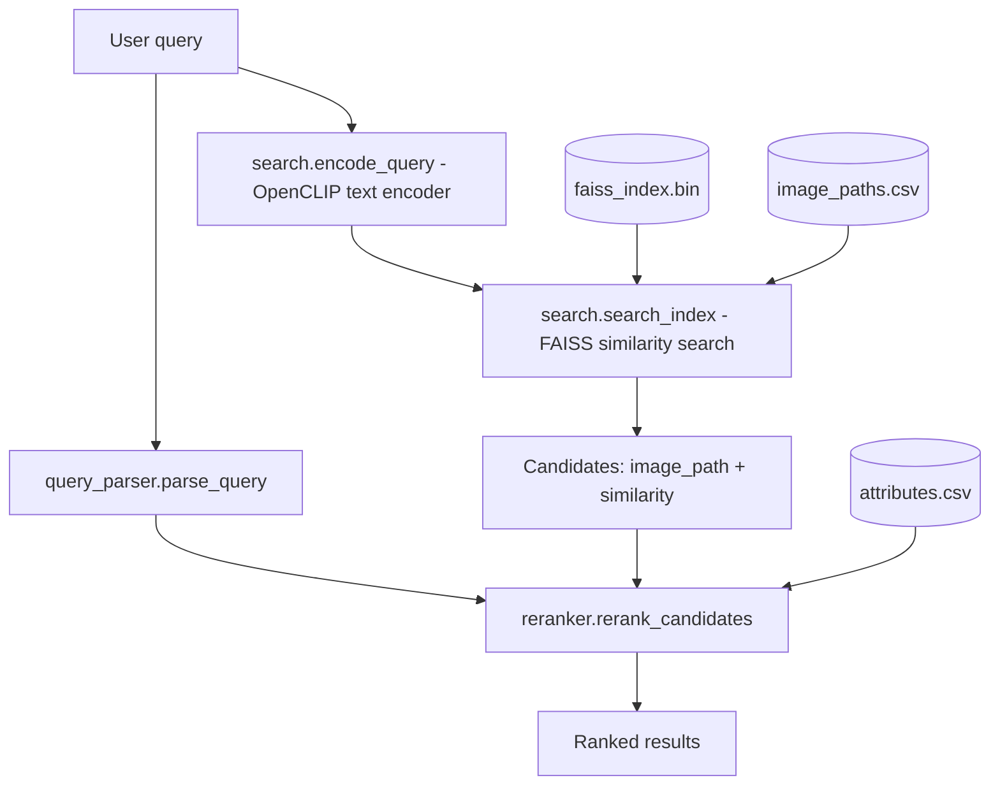

# retriever

The `retriever` module is the query-time half of the fashion retrieval pipeline. Given a natural-language query, it returns a ranked list of matching images from a dataset that has already been indexed offline.

It does this in two stages: a fast approximate nearest-neighbor search over CLIP embeddings (via FAISS), followed by a deterministic reranking pass that re-scores the shortlist using structured fashion attributes extracted from each image's caption. The reranking stage exists because embedding similarity alone tends to miss specific, compositional requests — "a red jacket" and "a red jacket in an office" can retrieve very similar candidate sets from FAISS even though only one of them satisfies the query.

This module assumes indexing has already happened. It does not encode images, build the FAISS index, generate captions, or extract attributes — it only consumes the artifacts those steps produce.

---

## Module Structure

| File | Role |
|---|---|
| `search.py` | Orchestrates the end-to-end retrieval flow — loads the CLIP model and index, parses and embeds the query, runs FAISS search, and hands off to the reranker. This is the entry point. |
| `query_parser.py` | Extracts structured attributes (color, garment type, scene, style, etc.) from a raw query string using controlled vocabularies and regular expressions. No ML involved. |
| `reranker.py` | Loads the precomputed attribute table and rescoring/resorts FAISS candidates based on how well their attributes match the parsed query. |

---

## Retrieval Pipeline

At a high level, a query flows through three stages: **parse → retrieve → rerank**.



The query is used twice, independently: once as raw text for the CLIP encoder (semantic similarity), and once parsed into structured terms for the reranker (exact attribute matching). Both paths run off the same original query string — the reranker never sees the CLIP embedding, and the encoder never sees the parsed attributes.

---

## Core Components

### `search.py`

This is the module you actually run. Its job is purely orchestration — it doesn't implement any retrieval or scoring logic itself, it wires together the other two modules plus a FAISS index.

Key functions:

- **`load_clip_model`** — loads the OpenCLIP model and tokenizer used to embed the query. This must be the same model checkpoint used to build the image index (`ViT-B-32`, `laion2b_s34b_b79k`), since query and image embeddings only make sense compared against each other if they live in the same vector space.
- **`encode_query`** — embeds the raw query text and L2-normalizes the result, so that FAISS's inner-product search behaves as cosine similarity.
- **`search_index`** — runs the FAISS lookup and converts raw index positions back into image paths, returning a list of `{image_path, similarity}` candidates.
- **`main`** — ties everything together: reads a query interactively, runs it through parsing, embedding, FAISS search, and reranking, then prints the final ranked list.

### `query_parser.py`

A deterministic, rule-based parser — no LLM, no embedding model. It matches a query string against fixed vocabularies for colors, garments (upper/lower/outerwear/footwear), accessories, scene, and style, using case-insensitive regex matching. Anything in the query that doesn't match a known term is preserved separately as `remaining_text`.

This module exists to give the reranker something structured to compare against. Its vocabularies are intentionally the same categories used when attributes were originally extracted from image captions during indexing, so a query term and an image attribute can be compared as literal strings.

### `reranker.py`

Takes the FAISS candidate list and the parsed query, and re-scores each candidate based on attribute overlap. The scoring itself is simple: sum a fixed weight for each attribute category where the candidate's value overlaps with what the query asked for. See [Reranking Strategy](#reranking-strategy) below for the exact weights and matching rules.

`reranker.py` has no knowledge of FAISS, embeddings, or CLIP — it operates purely on strings and dictionaries, which makes it easy to test or swap out independently of the retrieval backend.

---

## Data Flow

Retrieval depends on three files produced entirely by the indexing pipeline. None of them are created or modified by this module — if any are missing, the retriever will fail fast with a clear error rather than attempting to regenerate them.

| File | Produced by | Used for |
|---|---|---|
| `data/processed/faiss_index.bin` | `indexer/build_index.py` | Nearest-neighbor search over image embeddings. |
| `data/processed/image_paths.csv` | `indexer/image_encoder.py` | Maps FAISS result positions back to actual image file paths. |
| `data/processed/attributes.csv` | `indexer/attribute_extractor.py` | Per-image structured attributes, used by the reranker. |

The one assumption worth being explicit about: **`image_paths.csv` must be in the same row order used when the FAISS index was built.** The retriever looks up image paths by numeric position, not by any embedded identifier — if these two artifacts ever drift out of sync (e.g. the index is rebuilt from a different or reordered image set without regenerating `image_paths.csv` to match), results will silently point to the wrong images rather than raising an error.

`attributes.csv` is loaded entirely into memory as a `{image_path: {attribute: value}}` lookup. This is fine at the scale this pipeline targets, but means attribute lookup memory scales linearly with dataset size.

---

## Reranking Strategy

FAISS gives you a similarity ranking based on a single embedding comparison — it's fast and captures broad visual/semantic similarity well, but it has no explicit notion of "does this image actually have a red jacket" versus "does this image just look generally similar to the concept of a red jacket." Two visually similar images can have very different attribute compositions.

The reranker addresses this by scoring each FAISS candidate against the attributes it actually has on record, rewarding exact matches to what the query asked for:

| Attribute | Weight |
|---|---|
| Color | +3 |
| Upper garment | +3 |
| Lower garment | +3 |
| Outerwear | +3 |
| Footwear | +3 |
| Style | +2 |
| Scene | +1 |
| Accessories | +1 |

Garment and scene/style fields are matched as exact strings (a candidate either has "jacket" as its outerwear or it doesn't). Colors and accessories are matched as set overlap, since an image can have multiple colors or accessories and any overlap with the query counts.

The final ranking sorts primarily by this attribute score, and falls back to FAISS similarity as a tiebreaker — so a candidate with a stronger structured match is preferred over one that merely embeds closer to the query, but among equally-scored candidates, the more visually/semantically similar one still wins.

**Known limitation:** attributes are stored as a flat list per image (e.g. `colors: "red, black"`), with no link between a specific color and a specific garment. This means the reranker can score a query like "red jacket, black pants" as a match even for an image that actually has a black jacket and red pants — it verifies that the right *attributes* are present, not that they're bound to the right *garments*. Fixing this would require attribute extraction to associate colors with specific garment regions rather than the image as a whole.

---

## Example Query

Given the query `"red formal jacket"`, `query_parser.parse_query` produces:

```python
{
    "query": "red formal jacket",
    "remaining_text": "",
    "colors": ["red"],
    "upper_garment": [],
    "lower_garment": [],
    "outerwear": ["jacket"],
    "footwear": [],
    "accessories": [],
    "style": ["formal"],
    "scene": [],
}
```

Suppose FAISS returns a candidate whose stored attributes are `outerwear: "jacket"`, `colors: "red, black"`, `style: "formal"`. The reranker scores it:

```
outerwear match  → +3
color match (red)→ +3
style match      → +2
------------------------
total             8
```

A visually similar candidate that only matches on color, with no jacket or formal style recorded, would score only 3 — and would rank below the first candidate even if it had marginally higher FAISS similarity.

---

## Running the Module

**Prerequisite:** `faiss_index.bin`, `image_paths.csv`, and `attributes.csv` must already exist under `data/processed/` (generated by the `indexer/` pipeline).

Run the full retriever:

```bash
python -m retriever.search
```

You'll be prompted for a query interactively:

```
Enter your query: red formal jacket
```

The script prints the parsed query, the number of FAISS candidates retrieved, and the final reranked results with both attribute score and FAISS similarity shown per result.

Individual modules can also be run standalone for quick testing, each with a small built-in demo:

```bash
python -m retriever.query_parser   # parses a handful of example queries
python -m retriever.reranker       # reranks a small set of hardcoded dummy candidates
```

Neither of these standalone runs requires any files on disk — useful for sanity-checking parsing or scoring logic in isolation without a full index built.

---

## Design Decisions

**OpenCLIP for embeddings.** Using the same model for both image indexing and query encoding is what makes FAISS similarity search meaningful in the first place — query and image embeddings need to live in the same space. `ViT-B-32` with `laion2b_s34b_b79k` weights was chosen as the shared checkpoint across both sides of the pipeline.

**FAISS for retrieval.** Rather than comparing the query embedding against every stored image embedding directly, FAISS gives fast approximate nearest-neighbor search that scales far better as the dataset grows, while keeping the retrieval logic in this module simple — it's just an index lookup.

**Deterministic parsing instead of an LLM.** `query_parser.py` intentionally avoids any ML model. This keeps parsing fast, fully reproducible, and trivially debuggable — a query either matches a known vocabulary term or it doesn't, with no model-dependent variance. The tradeoff is that it only understands the fixed vocabulary it was given; a query using an unlisted synonym (e.g. "crimson" instead of "red") won't be recognized.

**Reranking after retrieval, rather than folding attributes into the embedding.** Keeping attribute matching as a separate, explicit scoring pass after FAISS retrieval — rather than trying to bake structured attributes into the embedding itself — makes the scoring logic transparent and independently adjustable (weights can be tuned without touching the embedding model or re-indexing anything).

---

## Limitations

- **No attribute-to-garment binding.** As described above, colors and other attributes aren't linked to specific garments, which can produce false-positive matches on compositional queries with multiple garments and colors.
- **Query vocabulary is fixed.** `query_parser.py` only recognizes terms explicitly listed in its vocabularies. Synonyms, misspellings, or attributes outside the predefined categories (brand names, patterns, materials, etc.) are not extracted and fall into `remaining_text`, which is not currently used anywhere downstream.
- **No non-interactive query mode.** `search.py` currently only accepts a query via an interactive terminal prompt — there's no way to pass a query as a script argument or call it as a function from other code without going through `main()`.
- **No graceful degradation on missing data.** If the required index/CSV files are missing or malformed, the module fails outright rather than falling back to a partial pipeline (e.g. FAISS-only ranking without reranking).
- **Tight coupling to index build order.** As noted in [Data Flow](#data-flow), correctness depends on `image_paths.csv` staying in sync with however the FAISS index was built — this isn't verified at runtime.
